# SIM800L
Данный проект позволяет управлять GSM-модулем SIM800L с помощью STM32F411, передавая в него команды по COM-порту. Пока реализован только набор команд для передачи TCP-сообщений, при этом остаётся возможность задавать стандартные AT-команды.
* [Используемая документация](#docs)
* [Описание создания проекта в STM32CubeMX для Keil µVision5](#project)
* [Описание созданных модулей](#files)
* [Список реализованных команд](#commands)
* [Пример работы](#example)  

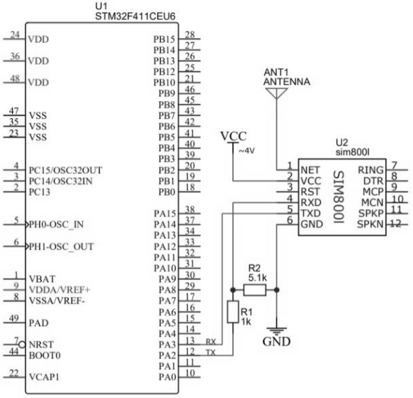 

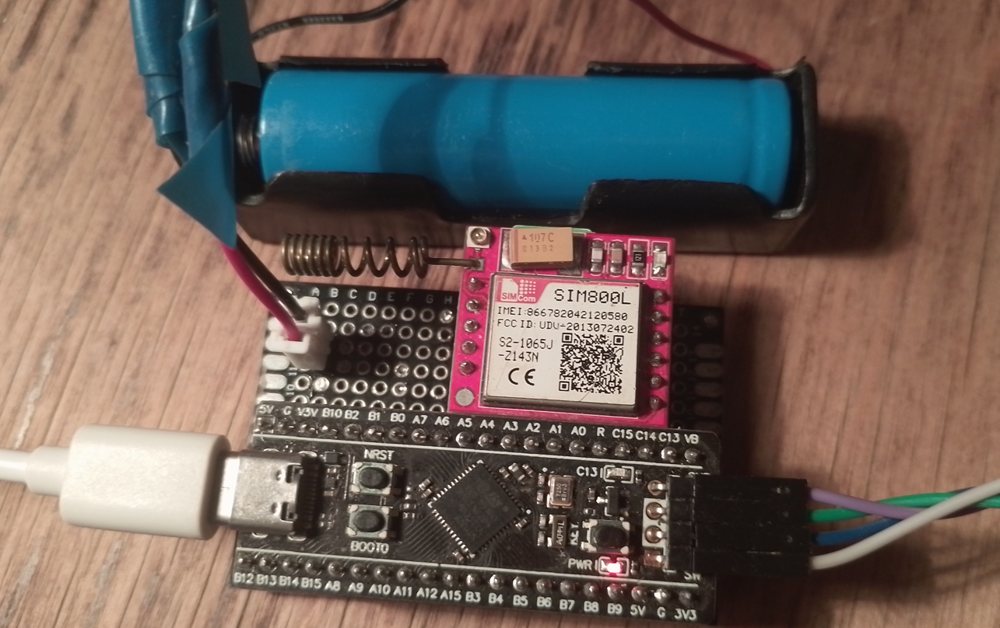 

<a name="docs"></a>
## Используемая документация
* [SIM800 Series TCP/IP Application Note V1.03](https://simcomturkiye.com/pdf/2G/SIM808/SIM800_Series_TCPIP_Application_Note_V1.03.pdf)
* [SIM800 Series AT Command Manual V1.12](
https://mt.morepower.ru/sites/default/files/documents/sim800_series_at_command_manual_v1.12.pdf)
* [SIM800 Hardware Design V1.10](https://simcomturkiye.com/pdf/2G/SIM800/SIM800_Hardware_Design_V1.10.pdf)
* [STM32F411xC/E Datasheet](https://www.st.com/resource/en/datasheet/stm32f411ce.pdf)
* [STM32F411xC/E Reference manual](https://www.st.com/resource/en/reference_manual/rm0383-stm32f411xce-advanced-armbased-32bit-mcus-stmicroelectronics.pdf)

<a name="project"></a> 
## Описание создания проекта в STM32CubeMX для Keil µVision5
После запуска STM32CubeMX выбран пункт «ACCESS TO MSU SELECTOR». В поле «Part Number» вводится STM32F411CE, затем выделятся пункт STM32F411CEUx, переход к настройке проекта по кнопке «Start Project».  
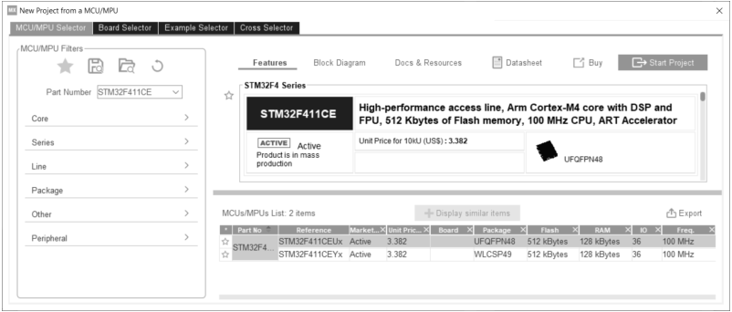   

В ходе настройки были заданы следующие параметры:
* System Core
    * RCC
        * High Speed Clock (HSE) – Crystal/Ceramic Resontor
* Timers
    * TIM2
        * Clock Source – Internal Clock
        * Parameter Settings → Counter Settings → Prescaler – 19199
        * Parameter Settings → Counter Settings → Counter Period – 4999
* Connectivity
    * USART2
        * Mode – Asynchronous
        * NVIC Settings → USART2 global interrupt – ✓
        * DMA Settings → Add → USART2_TX
        * DMA Settings → Add → USART2_RX (Mode: Circilar)
        * Parameter Settings → Basic Parameters → Baud Rate – 9600
    * USB_OTG_FS
        * Mode – Device_Only
* Middleware
    * USB_DEVICE
        * Class For FSIP – Communication Device Class (VirtualPortCom)
        
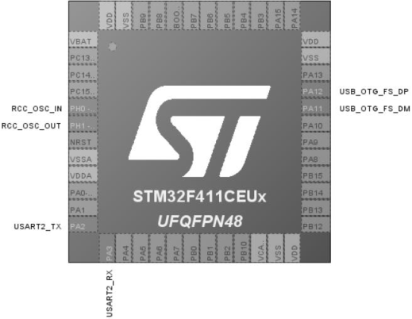   

Во вкладке «Clock Configuration» значение HCLK было выставлено в 96 МГц и запущен подбор параметров.  
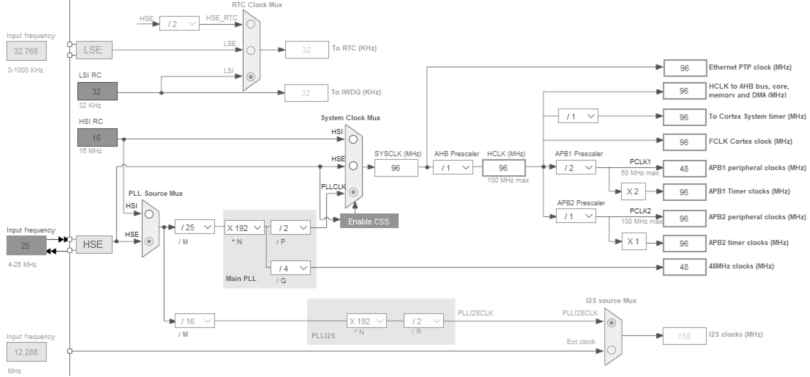   

Во вкладке «Project Manager» было задано название и директория проекта (без кириллицы). Для пункта «Applicatation Structure» выбран пункт «Basic», а в качестве IDE – «MDK-ARM» версии «V5». Последним этапом настройки в CubeMX являлось нажатие кнопки «GENERATE CODE». После генерации проекта CubeMX предложит открыть его в Keil.  
Файл для запуска проекта в Keil находится в заданной директории в папке «MDK-ARM» с расширением «*.uvprojx»  
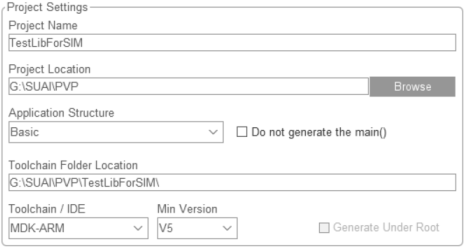   

Реализованная библиотека для работы с SIM800L состоит из 6 файлов, которые были помещены в папку «User» в указанной директории при генерации проекта. Для их отображения в Keil было применено ПКМ на названии проекта → «Add Group», затем «Add Existing Files to Group».  
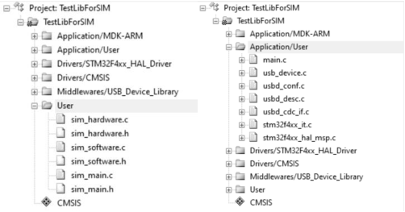   

Чтобы проект видел заголовочные файлы, нужно в «Options for Target…» → «C/C++» → «Include Paths» добавить путь до папки User.  
В группе «Application/User» находятся рабочие файлы проекта, некоторые из них требуется подредактировать. В них требуется вызвать функции из файла sim_hardware, чтобы получить ссылки на объекты устройств или узнать о возникновении определенного события:
```C
// Инициализация UART
void SIM_UART_Init(UART_HandleTypeDef *huart, IRQn_Type IRQn);
// Инициализация таймера
void SIM_TIM_Init(TIM_HandleTypeDef *tim, IRQn_Type IRQn);
// Инициализация для SIM
void SIM_Init(void);
// Выполнение кода в цикле main
void SIM_Loop(void);
// Прием данных с COM-порта
void SIM_CDC_Rx_Callback(uint8_t* Buf, uint32_t *Len);
// Сигнал о завершении передачи по COM-порту
void SIM_CDC_Tx_Callback(void);
// Установка вызова при прерывании по Idle
void SIM_UART_SetCallbackForIdle(void);
```
Изменения были проведены в следующих файлах:
* main.с
```C
…
/* USER CODE BEGIN Includes */
#include "sim_main.h"
/* USER CODE END Includes */
…
    /* USER CODE BEGIN 2 */
    SIM_UART_Init(&huart2, USART2_IRQn);
    SIM_TIM_Init(&htim2, TIM2_IRQn);
    SIM_Init();
    /* USER CODE END 2 */
…
    /* USER CODE BEGIN WHILE */
    while(1)
        SIM_Loop();
    /* USER CODE END WHILE */
…
```
* usbd_cdc_if.с
```C
…
/* USER CODE BEGIN INCLUDE */
#include "sim_hardware.h"
/* USER CODE END INCLUDE */
… 
static int8_t CDC_Receive_FS(uint8_t* Buf, uint32_t *Len)
{ 
    /* USER CODE BEGIN 6 */
    …
    SIM_CDC_Rx_Callback(Buf, Len);
    return (USBD_OK);
    /* USER CODE END 6 */
}
…
static int8_t CDC_TransmitCplt_FS(uint8_t *Buf, uint32_t *Len, uint8_t epnum)
{
    uint8_t result = USBD_OK;
    /* USER CODE BEGIN 13 */
    …
    SIM_CDC_Tx_Callback();
    /* USER CODE END 13 */
    return result;
}
…
```
* stm32f4xx_it.с
```C
…
/* USER CODE BEGIN Includes */
#include "sim_hardware.h"
/* USER CODE END Includes */
… 
void USART2_IRQHandler(void)
{ 
    …
    /* USER CODE BEGIN USART2_IRQn 1 */
    SIM_UART_SetCallbackForIdle();
    /* USER CODE END USART2_IRQn 1 */
}
```

<a name="files"></a> 
## Описание созданных модулей
Для упрощения работы с модулем SIM800L была написана библиотека, состоящая из трех модулей:
* sim_hardware – содержит все аппаратные настройки микроконтроллера и старается абстрагировать связь с модулем и персональным компьютером (ПК);
* sim_software – определяет функции для организации взаимодействия с модулем путем отправки AT-команд и реагирования на полученный ответ;
* sim_main – задает набор команд, которые доступны пользователем, и контролирует прием данных из ПК.

Модуль sim_hardware проектировался
с  целью обеспечить независимость других модулей от конкретного типа микроконтроллера путём определения ряда функция, таких как отправка данных SIM800L или ПК, а также переменной для отслеживания времени.
```C
// Отправка данных на SIM (UART)
void SendToSIM(char* msg);
// Отправка данных на ПК (COM-порт)
void SendToPC(char* msg);
// Отправка числа на ПК (COM-порт)
void SendI32ToPC(uint32_t value);
// Подготавливает и отображает буфер приема от SIM
void ShowBufSIM(void);
// Подготавливает и отображает буфер приема от ПК
void ShowBufPC(void);
// Возвращает время со старта STM (секунды)
uint64_t Time(void);
```
Также для получения ответа использовались функции обратного вызова. В рамках STM32F411 был опробован способ определения функция со слабой связностью с помощью атрибута __weak.
```C
// Для продолжения инициализации (sim_main)
__weak void Init(void)
{
    SendToPC("Init function is undefined! File sim_hardware.c\n");
}

// Для продолжения цикла (sim_software)
__weak void Loop(void)
{
    SendToPC("Loop function is undefined! File sim_hardware.c\n");
}

// Для оповещения о приеме с ПК (sim_main)
__weak void CommandCallback(char* cmd)
{
    SendToPC("CommandCallback function is undefined! File sim_hardware.c\n");
} 

// Для оповещения о приеме с UART (sim_software)
__weak void ResponceCallback(char* msg)
{
    SendToPC("ResponceCallback function is undefined! File sim_hardware.c\n");
}
```
Первая реализация работы с модулем работала на прерываниях. На практике не все сообщения логов доходили до терминала и не всегда было понятно, что в нем происходит. Также имелось ограничение на отправку данных с ПК на микроконтроллер в 64 байта. В следствии чего были реализованы следующие моменты, с целью повышения надежности передачи данных между устройствами:
* обмен данными по UART происходил с помощью DMA, причем приемник RX был настроен на циклический буфер, а получение данных осуществлялось по возникновению событие Idle, путем извлечения строки из буфера по указанным данных курсоров;
* при приеме больших данных функция CDC_Receive_FS извлекает сообщения по фрагментам в 64 байта. Поэтому следовало скопировать значения в отдельный буфер, так как после завершения работы функции будут извлечены следующие 64 байта;
* при несколько идущих подряд вызовов функции CDC_Transmit_FS, которая осуществляет отправку данных на ПК, было замечено, что часть сообщений пропадают. Для решения этой проблемы был создан отдельный массив для хранения указателей типа char*, а функция SendToPC осуществляет добавление сообщения в заданную очередь.

Для отправки AT-команд были написаны следующие структуры:
```C
// Функция для возврата управления
// Должен вернуть NONE_AT_PROG, CANCEL_AT_PROG, CONTINUE_AT_PROG или WAIT_AT_CMD
typedef uint8_t (*funcAT)(char* resp);

// Определяет команду для отправки на SIM
typedef struct atCommand
{ 
    // Команда, которая отправляется
    char *sendAT;
    // Ответ, который ожидается
    char *ifResponse;
    // Функция для вызова, при ожидаемом ответе
    funcAT thenCallback;
    // Функция для вызова, при неожиданном ответе
    funcAT elseCallback;
    // Время ожидания выполнения команды
    uint16_t timeout;
} atCommand;

// Хранит наименование текущей программы
typedef struct atProgram
{ 
    // Название
    char *name;
    // Указатель на последнюю команду
    uint8_t last;
} atProgram;
```
Структура atCommand содержит ссылку на текст AT-команды и ответ, который следует ожидать, в случае получения сообщения от SIM, значения сравниваются и в зависимости от результата будет вызвана одна из двух функций-обработчиков, возвращающие один из значений:
* NONE_AT_PROG – ничего не делать;
* CANCEL_AT_PROG – переход к следующей программе;
* CONTINUE_AT_PROG – переход к следующей команде;
* WAIT_AT_CMD – увеличить время ожидания ответа.

Структура atProgram предназначена для отслеживания, какая программа будет выполнена. Это используется для вывода сообщений об ошибках. Массив из atCommand определяет некоторую программу, на которые будут ссылаться из очереди выполняемой программы.  
Пример формирования программы:
```C
// Программа для отправки сообщения на сервер
atCommand sendTCP[] = {
    // Подключение
    CIPSTART,
    "OKCONNECTOK",
    TCPSetMsg,
    NULL,
    MAX_TIMEOUT,
    // Отключение
    "AT+CIPSEND\n",
    OKSEND,
    NULL,
    NULL,
    15,
    // Завершение
    "AT+CIPCLOSE\n",
    "CLOSEOK",
    TCPMsgSent,
    NULL,
    MAX_TIMEOUT 
};
#define COUNT_TCP_CMD 3;
```
В данной программе CIPSTART и OKSEND задаются извне. В первом случае задается команда на открытие соединения по заданному IP-адресу и серверу порта. Во втором, при выполнении «CIPSEND» требовалось дождаться курсора ">", загрузить данные и дождаться ответа «SEND OK». Установка ">" в OKSEND и обработчика, осуществляет функция TCPSetMsg. А в TCPMsgSent идет оповещение об завершении передачи. В модуле sim_main также содержится структура для определения команд пользователя, но они больше нужны для вывода справки по команде:
```C
// Шаблон функции команды
// Имя команды, параметры, число параметров.
typedef void (*cmdFunc)(char *cmd, char **param, uint8_t pcount);

// Информация о переменных
typedef struct pInfo
{ 
    // Шаблон переменных (<обязательный> или [нет])
    char *ptemp;
    // Описание переменных
    char *desc;
} paramInfo;

// Определяет команду для отправки на SIM
typedef struct command
{ 
    // Название команды
    char *name;
    // Описание команды
    char *desc;
    // Описание переменных
    paramInfo *param;
    // Функция команды
    cmdFunc func;    
} command;
```

<a name="commands"></a> 
## Список реализованных команд
| Название | Описание |
|-|-|
| closegprs | Отключает GPRS (доступ в интернет). |
| gettcp  | Возвращает текущие параметры IP-адреса и порта сервера. |
| help&nbsp;[command] | Вывод справки по параметрам. Если параметр не указан, то будет выведен список всех доступных команд. Если указан параметр all, то будет выведена полная версия справки по всем командам. Иначе, выводится сведение по указанной команде. |
| opengprs  | Активация контекста GPRS (доступ в интернет). |
| pcbuf | Отображает буфер ПК. Те данные, что были отправлены с компьютера. Используется чтобы узнать, что дошло в случае переполнения буфера. |
| sendtcp | Отправляет текст сообщения на сервер. После вызова команды запрашивается текст сообщения и сигналом завершения является второе нажатие кнопки Enter на пустой строке. |
| settcp&nbsp;&lt;ip&gt;&nbsp;&lt;port&gt; | Устанавливает значения IP-адреса и порта сервера, куда будут посылаться сообщения. |
| simbuf | Отображает буфер SIM. Те данные, что были получены по UART от модуля SIM. Используется чтобы узнать, что дошло в случае переполнения буфера или сбоя другой команды. |
| starttcp &lt;time&gt; | Посылает на сервер в пределах заданных секунд пакеты по 900 байт. Выводит сообщение какой пакет был отправлен и сколько времени было потрачено с предыдущего запроса. |
| stoptcp | Отменяет выполнение команды starttcp. |

<a name="example"></a> 
## Пример работы
Для взаимодействия с STM32F411 по COM-порту использовался терминал [Termite 3.4](https://www.npackd.org/p/com.compuphase.Termite/3.4) со следующими настройками:  
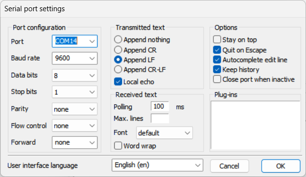 

Демонстрация старта программы и ввода стандартной AT-команды для получения информации об операторе связи (синий текст - введенная команда, зелёный - ответ от микроконтроллера):  
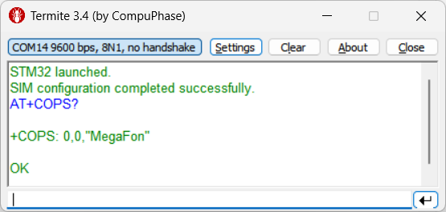  

Получение справки об пользовательской команде:  
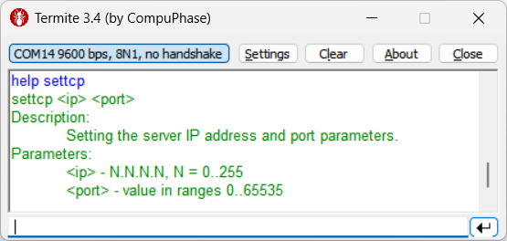  

Для проверки работы отправки сообщений использовался сервис тестирования TCP-соединений: [tcpbin.net](https://tcpbin.net), который расположен по IP-адресу: 46.226.106.127. Ниже представлен пример в котором, сначала указываем адрес и порт сервера, а затем дважды посылаем туда сообщения (отправка осуществляется после ввода пустой строки, т. е. повторное нажатие Enter):  
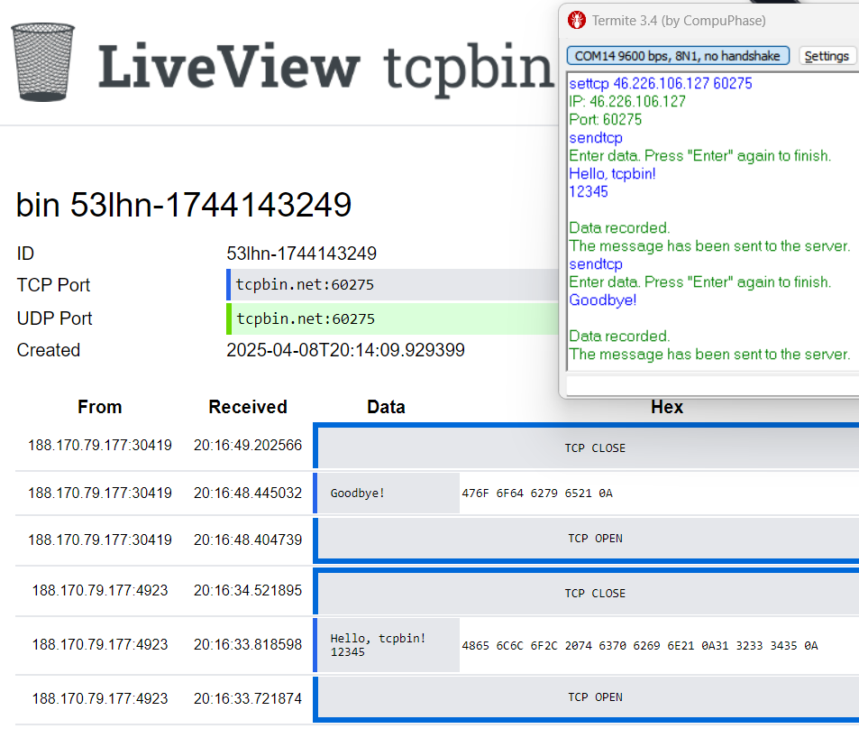
